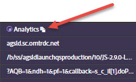

# Netzwerkinformationen {#network-information}

Um Netzwerkinformationen anzuzeigen, klicken Sie auf **[!UICONTROL Network]**.

Auf dem Bildschirm „Network“ werden Informationen zu allen Aufrufen zusammengefasst, die Adobe Experience Cloud-Lösungen auf der jeweiligen Seite durchführen – sortiert von links nach rechts. Standardparameter werden automatisch mit benutzerfreundlichen Namen versehen und so angeordnet, dass gemeinsame Parameter derselben Rolle zusammenstehen.

>[!TIP]
>
>Auf diesem Bildschirm können Sie überprüfen, ob die für Integrationen verwendeten Parameter, wie z. B. die Experience Cloud-Besucher-ID oder die Ergänzende-Daten-ID, über Integrationen hinweg einheitlich sind.

>[!NOTE]
>
>Zum jetzigen Zeitpunkt werden nicht alle innerhalb der Lösungsaufrufe übergebenen Parameter (z. B. Analytics-Kontextvariablen, benutzerdefinierte Target-Parameter oder die Kunden-IDs des Experience Cloud ID-Dienstes) auf dem Netzwerkbildschirm angezeigt.

Um alle Informationen anzuzeigen, klicken Sie auf **[!UICONTROL All]**.

Sie können die Informationen auch nach Lösung filtern. Wählen Sie die Lösung aus, die Sie anzeigen möchten. Sie können mehrere Lösungen gleichzeitig auswählen. Die ausgewählten Lösungsfilter werden markiert.

Klicken Sie auf ein Element in der Netzwerkansicht, um es zu vergrößern. In der erweiterten Ansicht können Sie die angezeigten Informationen in die Zwischenablage kopieren.

Verwenden Sie das Symbol oben in der jeweiligen Spalte, um die Serveraufruf-URL in die Zwischenablage zu kopieren, von wo aus Sie sie zur Referenz oder zur Fehlerbehebung in andere Dokumente einfügen können.

