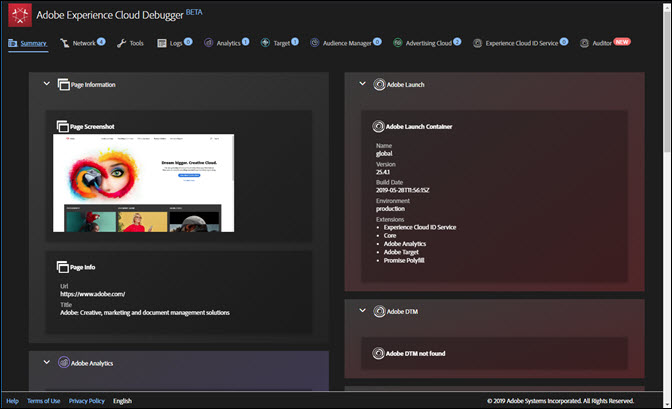

# Zusammenfassungsbildschirm{#summary-screen}

Um Adobe Experience Cloud Debugger auszuführen, klicken Sie in der Erweiterungsleiste auf das entsprechende Symbol und öffnen Sie die Seite, die Sie untersuchen möchten, in Chrome.

Hierdurch wird der Bildschirm „Summary“ von Experience Cloud Debugger angezeigt.

Dieser Bildschirm enthält eine Miniaturansicht der Seite sowie ihre URL und ihren Titel. Darüber hinaus werden hier Informationen zu den verschiedenen Adobe Experience Cloud-Lösungen angezeigt. Die angezeigten Informationen unterscheiden sich je nach Lösung. In der Regel sind jedoch Details wie Lösungsbibliothek und -version (z. B. „AppMeasurement v2.9“) sowie Konto-IDs (wie z. B. die Analytics Report Suite ID, der Target-Kundencode, die Audience Manager-Partner-ID usw.) enthalten.

Die blauen Zahlen neben den Registerkarten oben im Fenster geben die Anzahl der durchgeführten Server-Aufrufe an. Sie können diese Anzahl zurücksetzen, indem Sie auf der entsprechenden Registerkarte auf **[!UICONTROL Clear All Requests]** klicken.

In der folgenden Abbildung werden beispielsweise Informationen zu Adobe Target angezeigt. Um die unten abgebildeten Aktivitätsdetails ohne Authentifizierung abzurufen, müssen Sie den Debugging-Ereignis-Listener in Ihren Code oder Tag-Manager implementieren und die erforderlichen [Antwort-Tokens](https://docs.adobe.com/content/help/de-DE/target/using/administer/response-tokens.html) in der Target-Benutzeroberfläche aktivieren.

## Durchführen einer Prüfung in Adobe Experience Platform Auditor {#section-82bc57440406461ebf27a16855b71655}

Sie können Plaform Auditor verwenden, um eine Reihe von Audits auf Ihrer Seite auszuführen. Um Platform Auditor auszuführen, klicken Sie im oberen Menü auf **[!UICONTROL Auditor]** und anschließend auf **[!UICONTROL Audit Page Now]**. Um Platform Auditor zu öffnen, klicken Sie auf **[!UICONTROL Run Multi-Page Audit Now]**.

## In Experience Cloud Debugger angezeigte Informationen {#section-88a95ba53dca43d9b96a585e75e5f5cf}

Experience Cloud Debugger zeigt die folgenden Informationen zu den verschiedenen Lösungen an:

**Seiteninformationen**

<table id="table_FF3B9083524244D29AF350978A0AC236"> 
 <tbody> 
  <tr> 
   <td colname="col1"> 
Webseitenscreenshot 
 </td> 
   <td colname="col2"> 
Miniaturansicht der Seite 
 </td> 
  </tr> 
  <tr> 
   <td colname="col1"> 
URL 
 </td> 
   <td colname="col2"> 
URL der Seite 
 </td> 
  </tr> 
  <tr> 
   <td colname="col1"> 
Titel 
 </td> 
   <td colname="col2"> 
Der im Tag &lt;TITLE&gt; angegebene Name 
 </td> 
  </tr> 
 </tbody> 
</table>

**Adobe Analytics**

<table id="table_BEB9CC58E59D4D86BC895A8A51D84A2C"> 
 <tbody> 
  <tr> 
   <td colname="col1"> 
Report Suite(s) 
 </td> 
   <td colname="col2"> 
Eine <a href="https://docs.adobe.com/content/help/de-DE/analytics/admin/manage-report-suites/report-suites-admin.html" format="html" scope="external">Report Suite</a> definiert die vollständige, unabhängige Berichterstellung über eine bestimmte Website, eine Gruppe von Websites oder eine Untergruppe von Seiten einer Webseite. 
 </td> 
  </tr> 
  <tr> 
   <td colname="col1"> 
Version 
 </td> 
   <td colname="col2"> 
Die für die Seite definierte <a href="https://docs.adobe.com/content/help/de-DE/analytics/implementation/js/overview.html" format="html" scope="external"> AppMeasurement</a>-Version. 
 </td> 
  </tr> 
  <tr> 
   <td colname="col1"> 
Besucherversion 
 </td> 
   <td colname="col2"> 
Die Version der <a href="https://docs.adobe.com/content/help/de-DE/analytics/components/metrics/unique-visitors.html" format="html" scope="external">Besucher-ID</a>-Bibliothek. 
 </td> 
  </tr> 
  <tr> 
   <td colname="col1"> 
Webseitenname 
 </td> 
   <td colname="col2"> 
Die Variable <a href="https://docs.adobe.com/content/help/de-DE/analytics/implementation/vars/page-vars/page-variables.html" format="html" scope="external">pageName</a>, die an Analytics gesendet wird und einen benutzerfreundlichen Namen der Seite enthält. 
 </td> 
  </tr> 
  <tr> 
   <td colname="col1"> 
Module 
 </td> 
   <td colname="col2"> 
Die von Adobe Analytics geladenen Module. 
 </td> 
  </tr> 
 </tbody> 
</table>

**Audience Manager**

<table id="table_784AEABADBDA4D14BB9A7A9CB9EF07C3"> 
 <tbody> 
  <tr> 
   <td colname="col1"> 
Partner 
 </td> 
   <td colname="col2"> 
Der <a href="https://docs.adobe.com/content/help/de-DE/audience-manager/user-guide/dil-api/dil-instance-methods.html#getpartner" format="html" scope="external">Partnername</a> für die DIL-Instanz. 
 </td> 
  </tr> 
  <tr> 
   <td colname="col1"> 
Version 
 </td> 
   <td colname="col2"> 
Die <a href="https://docs.adobe.com/content/help/de-DE/audience-manager/user-guide/api-and-sdk-code/rest-apis/aam-api-dil-methods.html#return-version-dil" format="html" scope="external">Versionsnummer</a> für die DIL-Instanz. 
 </td> 
  </tr> 
  <tr> 
   <td colname="col1"> 
UUID 
 </td> 
   <td colname="col2"> 
Die <a href="https://docs.adobe.com/content/help/de-DE/audience-manager/user-guide/reference/ids-in-aam.html" format="html" scope="external">eindeutige Benutzer-ID</a>, die der DIL-Instanz zugeordnet ist. 
 </td> 
  </tr> 
 </tbody> 
</table>

**Adobe Experience Platform Launch**

<table id="table_E9574975444A407887E26514D1BB1601"> 
 <tbody> 
  <tr> 
   <td colname="col1"> 
Name 
 </td> 
   <td colname="col2"> 
Der Name der Platform Launch-<a href="https://docs.adobe.com/content/help/de-DE/launch/using/reference/admin/companies-and-properties.html" format="https" scope="external">Ressource</a>. 
 </td> 
  </tr> 
  <tr> 
   <td colname="col1"> 
Version 
 </td> 
   <td colname="col2"> 
Die <a href="https://developer.adobelaunch.com/extensions/reference/turbine-free-variable/" format="https" scope="external">Turbine</a>-Version. 
 </td> 
  </tr> 
  <tr> 
   <td colname="col1"> 
Build-Datum 
 </td> 
   <td colname="col2"> 
Das Build-Datum der Platform Launch-<a href="https://docs.adobe.com/content/help/de-DE/launch/using/reference/publish/libraries.html" format="https" scope="external">Bibliothek</a>. 
 </td> 
  </tr> 
  <tr> 
   <td colname="col1"> 
Umgebung 
 </td> 
   <td colname="col2"> 
Die von der Platform Launch-Bibliothek verwendete <a href="https://docs.adobe.com/content/help/de-DE/launch/using/reference/publish/environments.html" format="https" scope="external">Umgebung</a>. 
 </td> 
  </tr> 
  <tr> 
   <td colname="col1"> 
Skriptverzeichnis 
 </td> 
   <td colname="col2"> 
Das Verzeichnis, in dem das Platform Launch-Skript gespeichert wurde. 
 </td> 
  </tr> 
 </tbody> 
</table>

**Adobe DTM**

<table id="table_DC76D63FA6EF4891906B9E1D3E4A8A6C"> 
 <tbody> 
  <tr> 
   <td colname="col1"> 
Bibliotheksname 
 </td> 
   <td colname="col2"> 
Der Name der Adobe DTM-<a href="https://docs.adobe.com/content/help/de-DE/dtm/using/library-management.html" format="html" scope="external">Bibliothek</a>. 
 </td> 
  </tr> 
  <tr> 
   <td colname="col1"> 
Version 
 </td> 
   <td colname="col2"> 
Die Turbine-Version. 
 </td> 
  </tr> 
  <tr> 
   <td colname="col1"> 
Build-Datum 
 </td> 
   <td colname="col2"> 
Das Build-Datum der Platform Launch-<a href="https://docs.adobe.com/content/help/de-DE/dtm/using/library-management.html" format="html" scope="external">Bibliothek</a>. 
 </td> 
  </tr> 
  <tr> 
   <td colname="col1"> 
Umgebung 
 </td> 
   <td colname="col2"> 
Die von der DTM-Bibliothek verwendete Umgebung. 
 </td> 
  </tr> 
  <tr> 
   <td colname="col1"> 
Skriptverzeichnis 
 </td> 
   <td colname="col2"> 
Das Verzeichnis, in dem das DTM-Skript gespeichert wurde. 
 </td> 
  </tr> 
 </tbody> 
</table>

**Adobe Experience Cloud ID-Dienst**

<table id="table_274CFCEFA8F34D16BB546B4669EC0209"> 
 <tbody> 
  <tr> 
   <td colname="col1"> 
Experience Cloud Org ID 
 </td> 
   <td colname="col2"> 
Ihre <a href="https://docs.adobe.com/content/help/de-DE/id-service/using/home.html" format="https" scope="external"> Organisations-ID</a>. 
 </td> 
  </tr> 
  <tr> 
   <td colname="col1"> 
Version 
 </td> 
   <td colname="col2"> 
Die Version der <a href="https://docs.adobe.com/content/help/de-DE/analytics/components/metrics/unique-visitors.html" format="html" scope="external">Besucher-ID</a>-Bibliothek. 
 </td> 
  </tr> 
 </tbody> 
</table>

**Adobe Target**

<table id="table_D30E0CD20FB04E41862B22655136E043"> 
 <tbody> 
  <tr> 
   <td colname="col1"> 
Clientcode 
 </td> 
   <td colname="col2"> 
Ihr Target-<a href="https://docs.adobe.com/content/help/de-DE/target/using/implement-target/client-side/deploy-at-js/implementing-target-without-a-tag-manager.html" format="html" scope="external"> Kundencode</a>. 
 </td> 
  </tr> 
  <tr> 
   <td colname="col1"> 
Version 
 </td> 
   <td colname="col2"> 
Ihre aktuelle <a href="https://docs.adobe.com/content/help/de-DE/target/using/implement-target/client-side/target-atjs-versions.html" format="html" scope="external"> at.js</a>- oder mbox.js-Version. 
 </td> 
  </tr> 
  <tr> 
   <td colname="col1"> 
Globaler Mbox-Name 
 </td> 
   <td colname="col2"> 
Die<a href="https://docs.adobe.com/help/de-DE/target/using/implement-target/client-side/mbox-implement/global-mbox/understanding-global-mbox.html" format="html" scope="external"> globale Mbox</a> bezieht sich auf den einzelnen Server-Aufruf, der oben auf jeder Webseite in Ihrer Target-Implementierung durchgeführt wird. 
 </td> 
  </tr> 
  <tr> 
   <td colname="col1"> 
Mbox-Name 
 </td> 
   <td colname="col2"> 
Der Name einer Mbox an einer <a href="https://docs.adobe.com/content/help/de-DE/target/using/implement-target/client-side/mbox-implement/global-mbox/understanding-global-mbox.html" format="html" scope="external">Position</a> auf der Seite. Ist nur dann ohne Authentifizierung verfügbar, wenn Sie den Debugging-Ereignis-Listener in Ihren Code oder Tag-Manager implementieren und die erforderlichen <a href="https://docs.adobe.com/content/help/de-DE/target/using/administer/response-tokens.html" format="html" scope="external">Antwort-Tokens</a> in der Target-Benutzeroberfläche aktivieren. 
 </td> 
  </tr> 
  <tr> 
   <td colname="col1"> 
Aktivitätsname 
 </td> 
   <td colname="col2"> 
Name der Target-<a href="https://docs.adobe.com/content/help/de-DE/target/using/activities/activities.html" format="html" scope="external"> Kampagne oder -Aktivität</a>. Ist nur dann ohne Authentifizierung verfügbar, wenn Sie den Debugging-Ereignis-Listener in Ihren Code oder Tag-Manager implementieren und die erforderlichen <a href="https://docs.adobe.com/content/help/de-DE/target/using/administer/response-tokens.html" format="html" scope="external"> Antwort-Tokens</a> in der Target-Benutzeroberfläche aktivieren. 
 </td> 
  </tr> 
  <tr> 
   <td colname="col1"> 
Activity ID 
 </td> 
   <td colname="col2"> 
Die ID der Target-Aktivität. Ist nur dann ohne Authentifizierung verfügbar, wenn Sie den Debugging-Ereignis-Listener in Ihren Code oder Tag-Manager implementieren und die erforderlichen <a href="https://docs.adobe.com/content/help/de-DE/target/using/administer/response-tokens.html" format="html" scope="external">Antwort-Tokens</a> in der Target-Benutzeroberfläche aktivieren. 
 </td> 
  </tr> 
  <tr> 
   <td colname="col1"> 
Rezeptname 
 </td> 
   <td colname="col2"> 
Name des Target-<a href="https://docs.adobe.com/content/help/de-DE/target/using/experiences/experiences.html" format="html" scope="external"> Erlebnisses</a>. Ist nur dann ohne Authentifizierung verfügbar, wenn Sie den Debugging-Ereignis-Listener in Ihren Code oder Tag-Manager implementieren und die erforderlichen <a href="https://docs.adobe.com/content/help/de-DE/target/using/administer/response-tokens.html" format="html" scope="external">Antwort-Tokens</a> in der Target-Benutzeroberfläche aktivieren. 
 </td> 
  </tr> 
  <tr> 
   <td colname="col1"> 
Rezept-ID 
 </td> 
   <td colname="col2"> 
Die ID des Target-Rezepts. Ist nur dann ohne Authentifizierung verfügbar, wenn Sie den Debugging-Ereignis-Listener in Ihren Code oder Tag-Manager implementieren und die erforderlichen <a href="https://docs.adobe.com/content/help/de-DE/target/using/administer/response-tokens.html" format="html" scope="external">Antwort-Tokens</a> in der Target-Benutzeroberfläche aktivieren. 
 </td> 
  </tr> 
  <tr> 
   <td colname="col1"> 
Angebot 
 </td> 
   <td colname="col2"> 
Name des Target-<a href="https://docs.adobe.com/content/help/de-DE/target/using/experiences/offers/manage-content.html" format="html" scope="external"> Angebots</a>. Ist nur dann ohne Authentifizierung verfügbar, wenn Sie den Debugging-Ereignis-Listener in Ihren Code oder Tag-Manager implementieren und die erforderlichen <a href="https://docs.adobe.com/content/help/de-DE/target/using/administer/response-tokens.html" format="html" scope="external"> Antwort-Tokens</a> in der Target-Benutzeroberfläche aktivieren. 
 </td> 
  </tr> 
  <tr> 
   <td colname="col1"> 
Offer ID 
 </td> 
   <td colname="col2"> 
Die ID des Target-Angebots. Ist nur dann ohne Authentifizierung verfügbar, wenn Sie den Debugging-Ereignis-Listener in Ihren Code oder Tag-Manager implementieren und die erforderlichen <a href="https://docs.adobe.com/content/help/de-DE/target/using/administer/response-tokens.html" format="html" scope="external"> Antwort-Tokens</a> in der Target-Benutzeroberfläche aktivieren. 
 </td> 
  </tr> 
 </tbody> 
</table>
