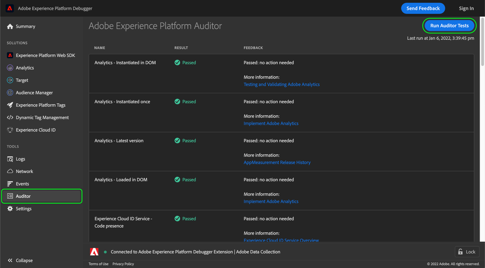

# Auditor

>[!IMPORTANT]
>
>Adobe Experience Platform Debugger ist aktuell in der Betaversion verfügbar. Die Dokumentation und Funktionalität können sich ändern.

In Adobe Experience Platform Debugger können Sie die **[!UICONTROL Auditor]** , um eine Reihe von Audittests auf Ihrer Seite auszuführen.

So verwenden Sie diese Funktion:

1. Auswählen **[!UICONTROL Auditor]** in der linken Navigation.
1. Wählen Sie **[!UICONTROL Run Auditor Tests]** aus. Sobald die Tests abgeschlossen sind, werden ihre Ergebnisse unten angezeigt.

In der Ergebnisliste werden der Test und das Ergebnis sowie Vorschläge zur Lösung von Problemen angezeigt.

## Interpretieren der Testergebnisse

Jeder Test wird gewichtet und Ihr Testergebnis entspricht der zugewiesenen Gewichtung. Wenn Sie einen Test mit einer Gewichtung von 5 bestehen, erhalten Sie fünf Punkte.

| Ergebnis | Beschreibung |
| --- | --- |
| 0 | Warnt Sie über Probleme, die Sie kennen sollten, aber sich nicht auf Ihr Ergebnis auswirken. |
| 1 | Empfiehlt eine Optimierung. Keine Auswirkung auf die Datengenauigkeit. |
| 2 | Wenn Sie diesen Test nicht durchführen, haben Sie keinen Zugriff auf die neuesten Funktionen und Fehlerbehebungen in Adobe Experience Cloud. |
| 3 | Tests zur Effizienz und zur Einhaltung der Best Practices bei der Implementierung. |
| 4 | Nichtbestehen bedeutet, dass Sie möglicherweise unzuverlässige Daten erfassen. |
| 5 | Nichtbestehen bedeutet, dass möglicherweise Datenverlust auftritt. |

Alle Tests werden entweder bestanden oder schlagen fehl. Während der Tests wird geprüft, ob die Testbedingungen erfüllt wurden oder nicht, sodass keine Abstufungsergebnisse für eine teilweise Erfüllung entstehen können. Wird bei einem Test beispielsweise die neueste Version einer Adobe-Lösung geprüft, erhalten Sie immer dasselbe Ergebnis – unabhängig davon, ob Sie nur eine oder fünf Version in Verzug sind. Die neuesten Versionen enthalten Leistungsverbesserungen und Fehlerkorrekturen. Daher wird empfohlen, die neueste Version zu verwenden.

Es wird **dringend empfohlen**, Ergebnisse der Stufe 4 oder 5 zu korrigieren.

Es wird **empfohlen**, Ergebnisse der Stufen 1 bis 3 zu korrigieren.

## Unterstützte Adobe-Technologien

Die Prüferfunktion kann die folgenden Adobe-Technologien bewerten:

* Adobe Advertising Cloud DSP
* Adobe Advertising Cloud Search
* Adobe Analytics
* Adobe Experience Cloud Identity-Service
* Adobe Target
* Tags (früher Adobe Experience Platform Launch)

## Testrubriken

Weitere Informationen zu den von dieser Funktion bereitgestellten Testrubriken finden Sie in den folgenden Dokumenten:

* [Tag-Konsistenz](./tag-consistency.md)
* [Tag-Präsenz](./tag-presence.md)
* [Konfiguration](./configuration.md)
* [Warnhinweise](./alerts.md)
