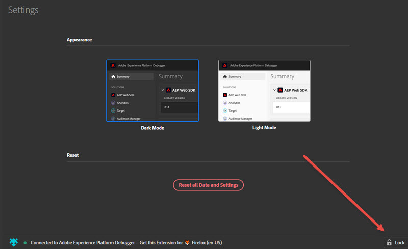

# Debugger konfigurieren

> [!IMPORTANT]
>
> Adobe Experience Cloud Debugger 2.0 befindet sich derzeit in der Betaphase. Dokumentation und Funktionalität können sich ändern.

Sie können bestimmte Aspekte der Funktionsweise von Debugger konfigurieren.

## Hell- oder Dunkelmodus

Nach dem Öffnen von Debugger können Sie das von Ihnen bevorzugte Erscheinungsbild auswählen, indem Sie ****aufrufen und entweder **Dunkler Modus**(Standard) oder **Heller Modus**auswählen.

## Zurücksetzen

Klicken Sie auf **[!UI STEUERELEMENT Alle Daten und Einstellungen]** zurücksetzen, um alle Daten zu löschen und zu den Standardeinstellungen zurückzukehren.

## Debugger auf einer Seite sperren

Wenn Sie Seiten Ihrer Site ändern, wird das Debugger-Fenster mit Informationen zu diesen Seiten aktualisiert. Der Name der Seite, mit der Sie gerade verbunden sind, wird unten im Bildschirm angezeigt. Um den Debugger auf einer Seite zu fixieren, klicken Sie rechts unten im Debugger-Fenster auf **[!UICONTROL Lock]**.

Dies ist nützlich, wenn Sie während des Debuggens Ihrer Seite die Dokumentation lesen oder Informationen auf einer anderen Seite anzeigen.