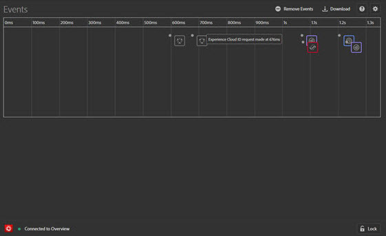

# Ereignisse {#events}

> [!IMPORTANT]
>
> Adobe Experience Cloud Debugger 2.0 befindet sich derzeit in der Betaphase. Dokumentation und Funktionalität können sich ändern.

Auf dem Bildschirm „Ereignisse“ werden die Ereignisse auf einer Timeline grafisch dargestellt.

Für jedes Ereignis wird auf der Timeline ein Symbol der entsprechenden Experience Cloud-Lösung angezeigt. Mit den Symbolen werden auch Änderungen an der Datenschicht gekennzeichnet (sofern aktiviert). Wenn Sie den Mauszeiger über ein Symbol bewegen, erhalten Sie eine Zusammenfassung des jeweiligen Ereignisses. Durch Anklicken des Ereignisses erhalten Sie weitere Details. Wenn Sie mehrere Ereignisse anzeigen möchten, klicken Sie bei gedrückter Umschalt- oder Strg-Taste auf die Ereignisse.

Durch Klicken auf ein Detail werden weitere Informationen dazu eingeblendet.

## Änderungen an der Datenschicht verfolgen

So aktivieren Sie das Verfolgen von Datenschichtänderungen auf der Timeline:

1. Klicken Sie oben rechts auf das Zahnradsymbol.
1. Geben Sie den Namen Ihrer Datenschicht ein.

   

1. Klicken Sie auf **[!UICONTROL Save]**.

In den Details zu Datenschichtänderungen werden alle gelöschten oder hinzugefügten Elemente angezeigt. Wenn Sie auf **{}** klicken, werden Details von tieferen Datenschichten angezeigt.

## Ereignisinformationen herunterladen

Klicken Sie auf **[!UICONTROL Download]**, um eine Excel-Datei mit Informationen zu Ihren Seitenaufrufen herunterzuladen.