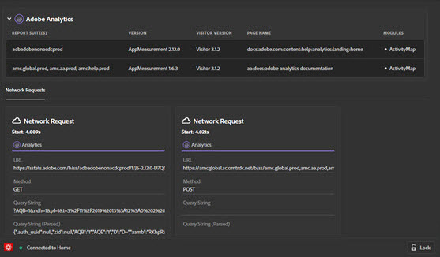

# „Lösungen“ {#solution-tabs}

>[!IMPORTANT]
>
>Adobe Experience Platform Debugger ist aktuell in der Betaversion verfügbar. Die Dokumentation und Funktionalität können sich ändern.

Klicken Sie auf eine Adobe Experience Cloud-Lösung, um deren Ergebnisse anzuzeigen.

## AEP-Web-SDK {#aep}

Der Bildschirm „AEP-Web-SDK“ enthält Informationen zum Adobe Experience Platform-Web-SDK. Klicken Sie auf **[!UICONTROL Configure]**, um die Konsolenprotokollierung ein- oder auszuschalten.

## Analytics {#section-f71dfcc22bb44c86bec328491606a482}

Der Analytics-Bildschirm enthält Informationen zu Ihrer [Analytics](https://docs.adobe.com/content/help/de-DE/analytics/landing/home.html)-Implementierung.

## Target {#section-988873ba5ede4317953193bd7ac5474c}

Verwenden Sie den Target-Bildschirm, um [Target](https://docs.adobe.com/content/help/de-DE/target/using/target-home.html)-Anfragen anzuzeigen<!-- or [Mbox Trace](https://docs.adobe.com/content/help/en/target/using/activities/troubleshoot-activities/content-trouble.html) response details-->.

## Audience Manager {#section-1d4484f8b46f457f859ba88039a9a585}

Über die Registerkarte [Audience Manager](https://docs.adobe.com/content/help/de-DE/audience-manager/user-guide/aam-home.html) können Sie Details von [Ereignissen](https://docs.adobe.com/content/help/de-DE/audience-manager/user-guide/api-and-sdk-code/dcs/dcs-event-calls/dcs-event-calls.html) anzeigen. Klicken Sie auf eine Organisation, um sie zu erweitern und detaillierte Informationen anzuzeigen.

## Launch {#section-ee80a9c509f2462c89c1e5bd8d05d7c8}

Im Launch-Bereich finden Sie Launch-Anfragen. Sie können auch auf **[!UICONTROL Configuration]** klicken, um [Einbettungscodes](https://docs.adobe.com/content/help/de-DE/launch/using/reference/upgrade/link-dtm-embed-code.html) zu konfigurieren. Im Experience Platform Debugger können weitere Einbettungscodes bearbeitet, ersetzt oder hinzugefügt werden. Wenn Sie sich anmelden, können Sie über die Dropdown-Liste eine andere Property auswählen.

## Dynamic Tag Management {#dynamic-tag-management}

Im Bereich „Dynamic Tag Management“ können Sie sich DTM-Anfragen anzeigen lassen. Sie können auch auf **[!UICONTROL Configuration]** klicken, um [Einbettungscodes](https://docs.adobe.com/content/help/de-DE/dtm/using/client-side/code.html) zu konfigurieren.

## Experience Cloud ID-Dienst {#section-a96c32f8e63a4991abb296f6e8ea01cf}

Über die Registerkarte „Experience Cloud ID Service“ können Sie [Experience Cloud ID-Dienst](https://docs.adobe.com/content/help/de-DE/id-service/using/home.html)-Anfragen anzeigen.